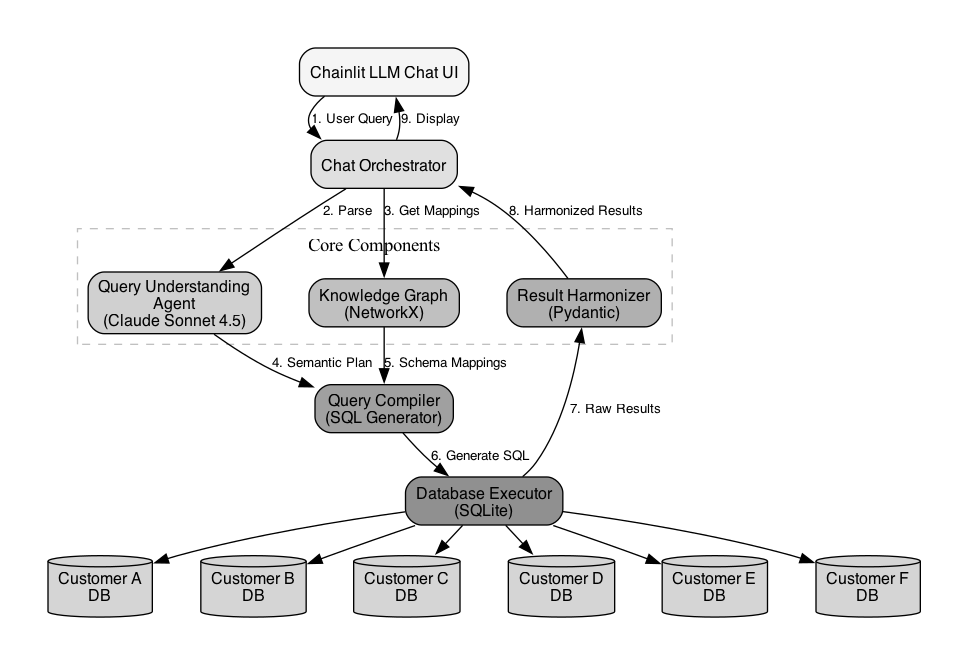

# Schema Translator

An intelligent contract schema translation system that enables querying across multiple enterprise customers with heterogeneous database schemas using LLM-powered semantic understanding.

## Architecture



The system uses a semantic query understanding approach powered by Claude Sonnet 4.5, with a knowledge graph mapping business concepts to customer-specific schemas, enabling unified querying across heterogeneous databases.

## Setup Instructions

### 1. Clone the Repository

```bash
git clone https://github.com/sanzgiri/schema_translator.git
cd schema_translator
```

### 2. Create Virtual Environment

```bash
uv venv
source .venv/bin/activate  
```

### 3. Install Dependencies

```bash
uv pip install -r requirements.txt
```

### 4. Configure Environment Variables

```bash
cp .env.example .env
# Edit .env and add your ANTHROPIC_API_KEY
```

### 5. Generate Mock Data

```bash
python -m schema_translator.mock_data
```

### 6. Run Tests

```bash
pytest tests/
```

### 7. Start the Application

**Local Development:**
```bash
chainlit run app.py --port 8000
```

**Railway Deployment:**
The app is configured for Railway deployment with automatic database initialization. Push to the `main` branch to trigger deployment.

## Project Structure

```
schema_translator/
├── README.md
├── requirements.txt
├── .env.example
├── .gitignore
├── databases/                      # SQLite databases
├── schema_translator/              # Main package
│   ├── config.py                   # Configuration management
│   ├── models.py                   # Pydantic data models
│   ├── mock_data.py                # Mock data generation
│   ├── knowledge_graph.py          # Schema knowledge graph
│   ├── query_compiler.py           # SQL generation
│   ├── database_executor.py        # Query execution
│   ├── result_harmonizer.py        # Result normalization
│   ├── orchestrator.py             # Main pipeline orchestrator
│   ├── agents/                     # LLM agents
│   └── learning/                   # Learning and feedback
├── tests/                          # Test suite
└── app.py                          # Chainlit application
```

## Tech Stack

- **Language:** Python 3.12+
- **LLM:** Anthropic Claude 4.5
- **Database:** SQLite
- **UI Framework:** Chainlit
- **Data Validation:** Pydantic
- **Graph:** NetworkX
- **Testing:** pytest
- **Deployment:** Railway


